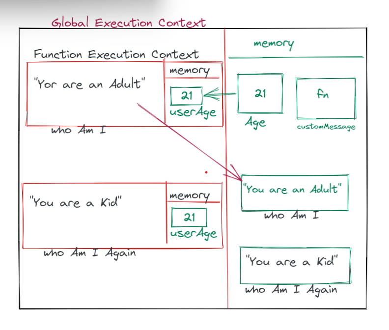

1. What does thread of execution means in JavaScript?

```js
The thread of execution is the way in which our code gets executed by the JavaScript engine.
```

2. Where the JavaScript code gets executed?

```js
// JavaScript Engine
// The JavaScript code gets executed inside the Execution Context.
// In JavaScript, execution context is an abstract concept that holds information about the environment within which the current code is being executed.
```

3. What does context means in Global Execution Context?

```js
   Context is the environment in which we are executing the code.
```

4. When do you create a global execution context.

```js
   Whenever we execute a code, the JavaScript Engine creates a Global Execution context for us.
```

5. Execution context consists of what all things?

```js
   Execution context contains a specific section which is used for storing data and is also known as memory. It also Contains A
   section where the execution of code happen.
```

6. What are the different types of execution context?

```js
// Global Execution Context/GEC
// Functional Execution Context/FEC
```

7. When global and function execution context gets created?

```js
   The GEC gets created whenever we run any code in JavaScript for the first time.
   The FEC gets created whenever we execute any function.
```

8. Function execution gets created during function execution or while declaring a function.

```js
   The Function execution gets created during function execution and gets deleted as soon as it return a value.
```

9. Create a execution context diagram of the following code on your notebook. Take a screenshot/photo and store it in the folder named `img`. Use `` to display it here.

```js
var user = "Arya";

function sayHello() {
  return `Hello ${user}`;
}

var userMsg = sayHello(user);
```

<!-- Put your image here -->


```js
var marks = 400;
var total = 500;

function getPercentage(amount, totalAmount) {
  return (amount * 100) / totalAmount;
}

var percentageMarks = getPercentage(marks, total);
var percentageProfit = getPercentage(400, 200);
```

<!-- Put your image here -->


```js
var age = 21;

function customeMessage(userAge) {
  if (userAge > 18) {
    return `You are an adult`;
  } else {
    return `You are a kid`;
  }
}

var whoAmI = customeMessage(age);
var whoAmIAgain = customeMessage(12);
```

<!-- Put your image here -->


